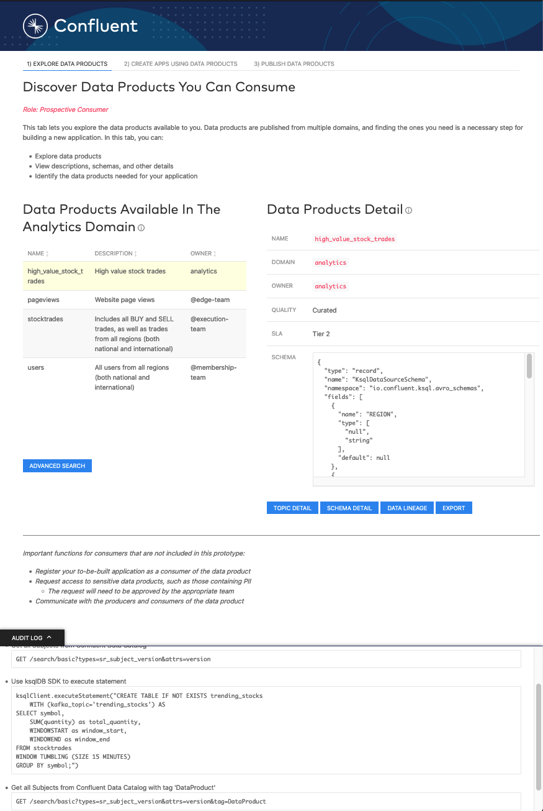

# Confluent Data Mesh Demo

A Data Mesh prototype built on [Confluent Cloud](https://www.confluent.io/confluent-cloud/tryfree/).



## Hosted Version

The Data Mesh demo is available in a hosted environment by visiting:

https://data-mesh-demo.herokuapp.com/

The hosted version of the demo allows you to see a subset of the full demo functionality without 
requiring you to run any code locally. When you would like to run a full version of the demo, follow the 
[Running Locally](#running-locally) instructions below.

<!--
*TODO Blog Link*
A companion blog post can be found here:
-->

## Running Locally 

###  Prerequisties
* OSX or Linux OS. No windows compatibility due to script specifics.
* [Confluent Cloud](https://www.confluent.io/confluent-cloud/tryfree/) account
  * New Confluent Cloud signups receive _$400_ to spend within Confluent Cloud during their first 60 days.
    Use Confluent Cloud promo code `DATAMESH200` to receive an additional **$200** free usage (Valid until December 31, 2023)
      (Please see our promotional disclaimer page for more information: https://www.confluent.io/confluent-cloud-promo-disclaimer/)
    This will sufficiently cover one day of running this example, beyond which you may be billed 
    for the Confluent Cloud resources until you destroy them. Enter the promo code in the Billing & payment page
    under the Payment details subsection.

* [Confluent CLI](https://docs.confluent.io/confluent-cli/current/install.html) `v2.6.1` or later
* [jq](https://stedolan.github.io/jq/download/)

#### Docker
For conviencne, a Docker container is pre-built and will be used by default.
* [Docker](https://docs.docker.com/get-docker/)

#### Build and run from source
If you prefer not to use Docker, you can build and run the project from source locally. The following additional developer tools are required:

* [Node](https://nodejs.org/en/download/) version >= 12.13.00
* [npm](https://docs.npmjs.com/cli/v7/configuring-npm/install)
* [Yarn](https://www.npmjs.com/package/yarn)

### Instructions

* Clone the repository and change into the project directory
  ```sh
  git clone https://github.com/confluentinc/data-mesh-demo
  cd data-mesh-demo
  ```

* Ensure your `confluent` CLI is logged into Confluent Cloud (the ``--save`` argument saves your Confluent Cloud 
  user login credentials or refresh token (in the case of SSO) to the local ``netrc`` file, preventing timeouts)
  ```sh
  confluent login --save
  ```

* NOTE: You must ensure you remain logged into Confluent Cloud. If you log out during the setup process, you will need to set your default environment and cluster. You may also find yourself logged out during the `make destroy` process, and must log back in and set the environment to the data mesh demo env. 
eg:
```sh
➜  data-mesh-demo git:(main) ✗ confluent environment list

       ID      |                 Name                   
---------------+----------------------------------------
  * env-aaaaaa | ccloud-default                       
    env-dmdemo | ccloud-xxxxxxxxxxxx-data-mesh-demo  
```
Then set the default environment back to the "-data-mesh-demo" suffix:

```sh
➜  data-mesh-demo git:(main) ✗ confluent environment use env-dmdemo                             
Now using "env-dmdemo" as the default (active) environment.
```
Now your `confluent` commands, and others like `make destroy` should work as expected.


  
* If you want to create a new Data Mesh on Confluent Cloud as well as build and run the demo, this command 
  creates Confluent Cloud resources, including an environment, Apache Kafka cluster,
  [ksqlDB](https://ksqldb.io/) Application, and sample Data Products
  <br/><br/>
  **Note**: The script waits for all cloud resources to be fully provisioned and *can take 15+ minutes* to complete. 
  In addition, the command needs to be run from a new terminal (not one that has run this command previously).

To build the data mesh and run the application in Docker, use:
  ```sh
  make data-mesh
  ```

To build and run the data mesh from source, use:
  ```sh
  make data-mesh-from-source
  ```

  Once the above command is complete, a configuration file for your new data mesh environment will be located in 
  the `stack-configs` folder local to this project. The file path will resemble 
  `stack-configs/java-service-account-1234567.config`. This file contains important security and configuration 
  data for your new data mesh environment. You should protect this file and retain it as you'll need it later 
  to destroy the new data mesh environment.

 
* If you previously ran the `make data-mesh` command and still have the Confluent Cloud environment set as current in the CLI, you can skip the previous data mesh creation step and just re-run the demo server with:
  ```sh
  make run-docker
  ```
 
* Once the data mesh creation and demo run process is complete, you will see the Spring Boot banner 
  and log entries that look similar to: 
  ```
  ...
    .   ____          _            __ _ _
   /\\ / ___'_ __ _ _(_)_ __  __ _ \ \ \ \
  ( ( )\___ | '_ | '_| | '_ \/ _` | \ \ \ \
   \\/  ___)| |_)| | | | | || (_| |  ) ) ) )
    '  |____| .__|_| |_|_| |_\__, | / / / /
   =========|_|==============|___/=/_/_/_/
  ...
  2021-10-23 14:02:31.473  INFO 27995 --- [           main] o.s.b.w.embedded.tomcat.TomcatWebServer  : Tomcat started on port(s): 8080 (http) with context path ''
  ...
  2021-10-23 14:02:31.475  INFO 27995 --- [           main] o.s.m.s.b.SimpleBrokerMessageHandler     : Started.
  2021-10-23 14:02:31.489  INFO 27995 --- [           main] io.confluent.demo.datamesh.DataMeshDemo  : Started DataMeshDemo in 2.337 seconds (JVM running for 2.651)
  Log ....
  ```
 
* To view the data mesh demo, open a web browser to: http://localhost:8080

### Teardown

Once you are done with the Data Mesh demo you'll want to stop the server and destroy the cloud resources.

* Stop the demo web service by issuing `<ctrl-c>` in the terminal where you started it.

* Destroy the Data Mesh resources in Confluent Cloud (including the environment, cluster, and ksqlDB app).
 
  (_Note_: This command expects the path to the configuration file created during the `make data-mesh` 
  command to be present in the `CONFIG_FILE` environment variable. If you started a new terminal you may need to 
  set the value to the appropriate file):
  ```sh
  make destroy
  ```
  
### Data Mesh Demo API Usage

The Data Mesh Demo models a data mesh via a REST API. The following are examples of some functions you can perform
with the REST API directly. By default, the REST API listens on http://localhost:8080

* Discover the existing data products:
  ```sh
  curl -s localhost:8080/priv/data-products | jq
  ```
  ```json
  [
    {
      "@type": "DataProduct",
      "name": "users",
      "qualifiedName": "lsrc-dnxzz:users",
      "description": "All users from all regions (both national and international)",
      "owner": "@membership-team",
      "domain": "membership",
      "sla": "tier-1",
      "quality": "authoritative",
      "urls": {
        "schemaUrl": "https://confluent.cloud/environments/env-op2xo/schema-registry/schemas/users-value",
        "portUrl": "https://confluent.cloud/environments/env-op2xo/clusters/lkc-5joyz/topics/users",
        "lineageUrl": "https://confluent.cloud/environments/env-op2xo/clusters/lkc-5joyz/stream-lineage/stream/topic-users/n/topic-users/overview",
        "exportUrl": "https://confluent.cloud/environments/env-op2xo/clusters/lkc-5joyz/connectors/browse"
      },
      "schema": {
        "subject": "users-value",
        "version": 1,
        "id": 100003,
        "schema": "{\"type\":\"record\",\"name\":\"users\",\"namespace\":\"ksql\",\"fields\":[{\"name\":\"registertime\",\"type\":\"long\"},{\"name\":\"userid\",\"type\":\"string\"},{\"name\":\"regionid\",\"type\":\"string\"},{\"name\":\"gender\",\"type\":\"string\"}],\"connect.name\":\"ksql.users\"}"
      }
    },
    ...
  ]
  ```

* Get one specifc data product. This requires the qualified name of the data product:

  ```sh
  curl -s localhost:8080/priv/data-products/lsrc-w8v85:users | jq
  ```
  ```json
  {
    "@type": "DataProduct",
    "name": "users",
    "qualifiedName": "lsrc-dnxzz:users",
    "description": "All users from all regions (both national and international)",
    "owner": "@membership-team",
    "domain": "membership",
    "sla": "tier-1",
    "quality": "authoritative",
    "urls": {
      "schemaUrl": "https://confluent.cloud/environments/env-op2xo/schema-registry/schemas/users-value",
      "portUrl": "https://confluent.cloud/environments/env-op2xo/clusters/lkc-5joyz/topics/users",
      "lineageUrl": "https://confluent.cloud/environments/env-op2xo/clusters/lkc-5joyz/stream-lineage/stream/topic-users/n/topic-users/overview",
      "exportUrl": "https://confluent.cloud/environments/env-op2xo/clusters/lkc-5joyz/connectors/browse"
    },
    "schema": {
      "subject": "users-value",
      "version": 1,
      "id": 100003,
      "schema": "{\"type\":\"record\",\"name\":\"users\",\"namespace\":\"ksql\",\"fields\":[{\"name\":\"registertime\",\"type\":\"long\"},{\"name\":\"userid\",\"type\":\"string\"},{\"name\":\"regionid\",\"type\":\"string\"},{\"name\":\"gender\",\"type\":\"string\"}],\"connect.name\":\"ksql.users\"}"
    }
  }
  ```

* Get all the data products and topics in one list:
  ```sh
  curl -s localhost:8080/priv/data-products/manage | jq
  ```
  ```json
  [
    {
      "@type": "DataProduct",
      "name": "users",
      "qualifiedName": "lsrc-dnxzz:users",
      "description": "All users from all regions (both national and international)",
      "owner": "@membership-team",
      "domain": "membership",
      "sla": "tier-1",
      "quality": "authoritative",
      "urls": {
        "schemaUrl": "https://confluent.cloud/environments/env-op2xo/schema-registry/schemas/users-value",
        "portUrl": "https://confluent.cloud/environments/env-op2xo/clusters/lkc-5joyz/topics/users",
        "lineageUrl": "https://confluent.cloud/environments/env-op2xo/clusters/lkc-5joyz/stream-lineage/stream/topic-users/n/topic-users/overview",
        "exportUrl": "https://confluent.cloud/environments/env-op2xo/clusters/lkc-5joyz/connectors/browse"
      },
      "schema": {
        "subject": "users-value",
        "version": 1,
        "id": 100003,
        "schema": "{\"type\":\"record\",\"name\":\"users\",\"namespace\":\"ksql\",\"fields\":[{\"name\":\"registertime\",\"type\":\"long\"},{\"name\":\"userid\",\"type\":\"string\"},{\"name\":\"regionid\",\"type\":\"string\"},{\"name\":\"gender\",\"type\":\"string\"}],\"connect.name\":\"ksql.users\"}"
      }
    },
    {
      "@type": "Topic",
      "name": "trending_stocks",
      "qualifiedName": "lsrc-dnxzz:trending_stocks"
    },
    ...
  ]
  ```

## Client Development Instructions

The client is built with [Elm](https://elm-lang.org/) and the source is build as part of the Java server build step. 
If you would like to develop the client code independently, you can use the following.

To run a webserver hosting the client code that will watch for changes and load
connected browsers:
```sh
cd client
yarn
yarn dev
```

The website is now served at http://localhost:9000.
